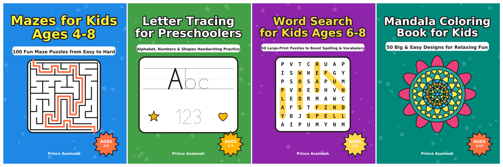

# Activity Books, Puzzle Books & a Cookbook: Ready to Publish on Amazon KDP

13 print-ready paperback books, each with its own interior PDF and full-wrap cover PDF (in
`books/<number-name>/`). All art is drawn by the code in `generator/`, so every page is
original: no licensed characters, no clip art, no AI images. That means **no copyright
problems**, and when KDP asks about AI-generated content you can honestly answer **"No"**.

| # | Book | For | Pages | Print cost | Suggested price | Royalty per sale* |
|---|------|-----|-------|-----------|-----------------|------------------|
| 1 | Mazes for Kids Ages 4-8 (100 mazes) | Kids 4-8 | 122 | $2.46 | $8.99 | ~$2.93 |
| 2 | Letter Tracing for Preschoolers | Kids 3-5 | 56 | $2.30 | $7.99 | ~$2.49 |
| 3 | Word Search for Kids Ages 6-8 (50 puzzles) | Kids 6-8 | 64 | $2.30 | $7.99 | ~$2.49 |
| 4 | Mandala Coloring Book for Kids (50 designs) | Kids 6-12 | 106 | $2.30 | $8.99 | ~$3.09 |
| 5 | Mazes for Kids Ages 6-10, Book 2 (100 harder mazes) | Kids 6-10 | 122 | $2.46 | $8.99 | ~$2.93 |
| 6 | Dot to Dot for Kids Ages 4-8 (50 pictures, incl. dinosaurs) | Kids 4-8 | 56 | $2.30 | $7.99 | ~$2.49 |
| 7 | Christmas Activity Book for Kids | Kids 4-8 | 70 | $2.30 | $8.99 | ~$3.09 |
| 8 | Halloween Activity Book for Kids | Kids 4-8 | 70 | $2.30 | $8.99 | ~$3.09 |
| 9 | The Good Old Days Large Print Word Search (60 puzzles) | Seniors | 74 | $2.30 | $9.99 | ~$3.69 |
| 10 | Large Print Sudoku for Seniors (100 puzzles) | Seniors | 120 | $2.44 | $9.99 | ~$3.55 |
| 11 | Dementia Activity Book for Seniors | Seniors / dementia | 98 | $2.30 | $12.99 | ~$5.49 |
| 12 | Easy Coloring Book for Seniors (50 designs) | Seniors / dementia | 102 | $2.30 | $9.99 | ~$3.69 |
| 13 | The Little Chef Cookbook for Kids (30 recipes, **full color**) | Kids 8-12 | 78 | ~$2.99** | $14.99 | ~$6.00 |

\*Royalty on Amazon.com = 60% × list price − print cost (KDP 2026 US rates).
\*\*Standard color is $1.00 + $0.0255 per page by KDP's published formula, but some sources
quote more. Check the cost KDP shows on the pricing page. Even at $4.50, $14.99 still pays
about $4.50 per sale.

## Why these books: the market research

**Kids' activity books**
- The Children's Activity Books category (mazes, dot-to-dot, tracing, word search) is one
  of the biggest on Amazon. "Kids activity books" gets about 90,000 searches a month, and
  about 40% of purchases are gifts.
- The bestsellers put the **age in the title** ("Ages 4-8"), and have **big, bold pages**, an
  **easy-to-hard progression**, an **answer key** and a **certificate**. Every kids' book here
  follows that pattern.
- By content type, sales split roughly into coloring (30%), puzzles like mazes and word
  searches (25%), drawing (20%), educational/tracing (15%), and games (10%).
- **Seasonal books** (Christmas, Halloween) sell hard for about 8 weeks a year. Publish the
  Halloween book by early September and the Christmas book by early October.
- **Series sell each other**: a "Book 2" gets bought by parents whose child finished Book 1.

**Seniors and dementia**
- "Dementia activities for seniors" is a strong, growing category. The top sellers are
  **large print**, **one activity per page**, a **mix of gentle activities** (word search,
  finish the saying, matching, counting, coloring) and **dignified, not childish** designs.
- "The Good Old Days" nostalgic large-print word searches and large-print sudoku are steady
  sellers, often bought by adult children as gifts for parents.
- These books sell for more ($9.99-$14.99) than kids' books.
- The books make no medical claims. Each says it is for enjoyment and is not medical advice.
  Keep your descriptions that way too, because KDP rejects health claims.

**Kids' cookbooks**
- The best sellers are big-publisher books with photos (America's Test Kitchen, Food Network).
  Many independent books still sell well as simple "first cookbooks for ages 8-12" with few
  ingredients. This one is in **full color** with safety guides, tick-box ingredients and
  "GROWN-UP HELP" labels. It has no food photos, so price it below the big publishers.

**Always:** avoid brand characters and names (Disney, Pokémon, Bluey, Minecraft and so on).
Amazon removes those books and can close your account.

Sources: [KDP Builder: best coloring book niches](https://kdpbuilder.com/blog/best-coloring-book-niches),
[KDP Easy: kids activity book guide](https://www.kdpeasy.com/blog/kids-activity-book-kdp-guide),
[Low Content Profits: KDP niches 2026](https://lowcontentprofits.com/low-content-book-niches-kdp/),
[Amazon Best Sellers: Children's Activity Books](https://www.amazon.com/Best-Sellers-Children's-Activity-Books/zgbs/books/3373),
[Amazon Best Sellers: Children's Maze Books](https://www.amazon.com/Best-Sellers-Children's-Maze-Books/zgbs/books/3380),
[Amazon New Releases: Dementia](https://www.amazon.com/gp/new-releases/books/16311461),
[Comfort a Life: best large print senior activity books 2026](https://comfortalife.com/vetted/12-best-large-print-senior-activity-books-in-2026/),
[Amazon Best Sellers: Children's Cookbooks](https://www.amazon.com/Best-Sellers-Children's-Cookbooks/zgbs/books/2655476011),
[KDP printing cost guide](https://cambric.pub/guides/kdp-printing-cost-guide/),
[KDP coloring book pricing](https://www.kdpeasy.com/blog/kdp-coloring-book-pricing),
[KDP AI disclosure rules](https://kdpbuilder.com/blog/kdp-ai-disclosure-rules).

## How to publish (about 20 minutes per book)

1. Go to **kdp.amazon.com** and sign in with your Amazon account. Then fill in
   **Account → Tax information** and **Getting paid** (bank details). You can't publish until
   both are complete.
2. Click **Create → Paperback**.
3. **Details page:** copy the title, subtitle, description and keywords for the book from
   the listing kit below. Author: **Doris Sarpong** (it must match the name on the covers).
   Reading age: use the book's age range for kids' books. Leave it blank for the senior books.
4. **Content page:**
   - ISBN: **Get a free KDP ISBN**.
   - Print options: trim **8.5 x 11 in**, **White paper**, Bleed: **No bleed**,
     Cover finish: **Matte**.
     - Books 1-12: **Black & white interior**.
     - Book 13 (cookbook): **Standard color interior**.
     - Books 9-12: if KDP offers a **Large print** option, tick it (their main text is 16 pt or larger).
   - Upload `interior.pdf` as the manuscript and upload `cover.pdf` as the cover
     ("Upload a cover you already have").
   - AI-generated content: **No**.
   - Click **Launch Previewer** and approve it.
5. **Pricing page:** choose Amazon.com as the primary marketplace and enter the suggested
   price. Leave Expanded Distribution off (it pays much less). Click **Publish**.
6. Review takes 3-7 days. When the book is live, order one **author copy** at print cost to
   check print quality.

**Publishing from the UK:** choose **Amazon.co.uk** as the primary marketplace and let KDP fill
in the other marketplaces from your UK price. Printed books have 0% VAT in the UK. The
UK print cost for black & white is a flat £1.93 up to 108 pages, then £0.85 + £0.01 per page.
Suggested UK prices and royalty (60% of price minus print cost):

| Books | UK print cost | UK price | Royalty per sale |
|---|---|---|---|
| 2, 3, 6 (56-64 pages) | £1.93 | £6.99 | ~£2.26 |
| 4, 7, 8 (70-106 pages) | £1.93 | £7.99 | ~£2.86 |
| 1, 5 (122 pages) | £2.07 | £7.99 | ~£2.72 |
| 9, 12 (seniors) | £1.93 | £8.99 | ~£3.46 |
| 10 (sudoku, 120 pages) | £2.05 | £8.99 | ~£3.34 |
| 11 (dementia) | £1.93 | £10.99 | ~£4.66 |
| 13 (cookbook, color) | shown in KDP | £12.99 | check in KDP |

**Suggested order:** Halloween (it's already late in the season) → Christmas (publish this
week to catch the holiday rush) → Dementia Activity Book → Good Old Days → Sudoku → the rest.

**Before you publish:** the covers and copyright pages say "Doris Sarpong". To use a
different pen name, change `AUTHOR` in `generator/common.py` and rebuild
(`pip install reportlab pypdfium2 pillow && python generator/build.py`).

**Tip:** the cover size depends on the page count. If you change the number of pages, run
`build.py` again so the spine width is recalculated.

---

## Listing kit

### 1. Mazes for Kids Ages 4-8
- **Title:** Mazes for Kids Ages 4-8
- **Subtitle:** 100 Fun Maze Puzzles from Easy to Hard: Activity Workbook for Boys and Girls
- **Description:**
  > Keep little minds busy with 100 big, bold mazes that grow with your child!
  >
  > Starting with simple warm-up mazes and building up to tricky challenges, this activity
  > book helps kids develop focus, patience, fine motor skills, and problem-solving, all
  > without a screen.
  >
  > **Inside you'll find:**
  > - 100 original mazes in 4 levels: Warm Up, Easy, Medium, and Tricky
  > - Large 8.5 x 11 inch pages with thick, clear lines
  > - Clear START and FINISH markers on every page
  > - A full answer key at the back
  > - A certificate of achievement to celebrate
  >
  > Perfect for home, road trips, waiting rooms, and quiet time. Makes a great gift!
- **Keywords (7 boxes):** maze books for kids 4-8 · mazes for kids ages 4-6 · activity book for kids ages 4-8 · maze puzzle book for kids · preschool activity workbook · travel activities for kids · kindergarten mazes
- **Categories:** Children's Books › Activities, Crafts & Games › Activity Books › Mazes · Children's Books › Education & Reference › Reading & Writing · Children's Books › Activities, Crafts & Games › Games

### 2. Letter Tracing for Preschoolers
- **Title:** Letter Tracing for Preschoolers
- **Subtitle:** Alphabet, Numbers & Shapes Handwriting Practice Workbook for Kids Ages 3-5
- **Description:**
  > Get your little one ready for school with this fun, first handwriting workbook!
  >
  > Kids start with simple pre-writing warm-ups (lines, zig zags, waves, and loops), then
  > trace every letter of the alphabet in uppercase and lowercase, practice simple words,
  > count and write numbers 0-20, and trace 8 basic shapes.
  >
  > **Inside you'll find:**
  > - Pre-writing warm-up pages to build pencil control
  > - Every letter A-Z with dotted tracing lines and a simple word (A is for apple!)
  > - Numbers 0-10 with counting stars to color, plus numbers 11-20
  > - 8 shapes to trace and color
  > - An "I can write my name" page and a certificate of achievement
  > - Big 8.5 x 11 inch pages with clear handwriting guide lines
- **Keywords:** letter tracing books for kids ages 3-5 · handwriting practice for kids · preschool workbook · abc tracing book · pre k workbooks ages 4-5 · number tracing for kids · kindergarten writing practice
- **Categories:** Children's Books › Education & Reference › Reading & Writing › Handwriting · Children's Books › Early Learning › Basic Concepts › Alphabet · Children's Books › Activities, Crafts & Games › Activity Books

### 3. Word Search for Kids Ages 6-8
- **Title:** Word Search for Kids Ages 6-8
- **Subtitle:** 50 Large-Print Puzzles to Boost Spelling & Vocabulary
- **Description:**
  > 50 themed word search puzzles with big, easy-to-read letters, made just for young
  > readers!
  >
  > From farm animals and dinosaurs to outer space and pirates, kids hunt for 500 words while
  > building spelling, vocabulary, reading, and focus skills.
  >
  > **Inside you'll find:**
  > - 50 fun themes with 10 words each
  > - Large-print 12x12 and 13x13 grids
  > - Puzzles 1-25: words go across and down. Puzzles 26-50: diagonal challenges too
  > - Tick-box word lists
  > - A full answer key and a certificate of achievement
  >
  > Great for home, the classroom, and travel!
- **Keywords:** word search for kids ages 6-8 · word search books for kids · large print word search for kids · spelling activity book · puzzle books for kids 6-8 · first grade activity book · second grade workbook
- **Categories:** Children's Books › Activities, Crafts & Games › Activity Books › Word Search · Children's Books › Education & Reference › Reading & Writing › Spelling · Children's Books › Activities, Crafts & Games › Games

### 4. Mandala Coloring Book for Kids
- **Title:** Mandala Coloring Book for Kids
- **Subtitle:** 50 Big & Easy Designs for Relaxing Fun, Ages 6-12
- **Description:**
  > Calm, creative fun for young artists!
  >
  > This coloring book has 50 original mandalas made for kids, with thick outlines and big
  > spaces that are easy to color with crayons, colored pencils, or markers. Coloring
  > mandalas helps children relax, focus, and explore color.
  >
  > **Inside you'll find:**
  > - 50 unique, original mandala designs, each one different
  > - Bold lines and big spaces, perfect for kids
  > - Single-sided pages, so markers won't bleed through onto the next design
  > - A color test page and a certificate of achievement
  > - Large 8.5 x 11 inch format
- **Keywords:** mandala coloring book for kids · coloring books for kids ages 8-12 · relaxing coloring book for kids · easy mandalas for kids · coloring book for girls and boys · mindfulness activity book for kids · kids coloring book ages 6-8
- **Categories:** Children's Books › Activities, Crafts & Games › Coloring Books · Children's Books › Arts, Music & Photography › Art › Drawing · Children's Books › Activities, Crafts & Games › Activity Books

### 5. Mazes for Kids Ages 6-10, Book 2
- **Title:** Mazes for Kids Ages 6-10
- **Subtitle:** 100 Challenging Maze Puzzles, Book 2: Activity Workbook for Boys and Girls
- **Description:**
  > Ready for a bigger challenge? This follow-up to *Mazes for Kids Ages 4-8* has 100
  > brand-new mazes that start at medium and climb all the way to Expert.
  >
  > - 100 original mazes in 4 levels: Easy, Medium, Hard, and Expert
  > - Large 8.5 x 11 inch pages
  > - Builds focus, planning, and problem-solving skills
  > - Full answer key and certificate of achievement
- **Keywords:** maze books for kids 6-8 · mazes for kids 8-10 · hard mazes for kids · maze puzzle book · activity book for kids 6-10 · brain games for kids · screen free activities
- **Categories:** Children's Books › Activities, Crafts & Games › Activity Books › Mazes · Children's Books › Activities, Crafts & Games › Games · Children's Books › Education & Reference

### 6. Dot to Dot for Kids Ages 4-8
- **Title:** Dot to Dot for Kids Ages 4-8
- **Subtitle:** 50 Connect the Dots Puzzles, Count 1 to 60: Dinosaurs, Animals, Rockets & More
- **Description:**
  > Count, connect, and color! Kids join the numbered dots to reveal 50 fun pictures:
  > animals, dinosaurs, rockets, castles, trucks and more.
  >
  > - 50 original pictures that start with 10 dots and build up to 60
  > - Big, clear numbers and a bold starting dot
  > - Practice counting, number order, and pencil control
  > - Color every picture when it's done
  > - Certificate of achievement
- **Keywords:** dot to dot books for kids ages 4-8 · connect the dots for kids · dot to dot for kids 3-5 · counting activity book · preschool activity book · dinosaur activity book · kindergarten workbook
- **Categories:** Children's Books › Activities, Crafts & Games › Activity Books › Dot to Dot · Children's Books › Early Learning › Basic Concepts › Counting · Children's Books › Activities, Crafts & Games › Coloring Books

### 7. Christmas Activity Book for Kids
- **Title:** Christmas Activity Book for Kids Ages 4-8
- **Subtitle:** Coloring, Mazes, Word Search & Dot to Dot Fun: A Stocking Stuffer for Boys and Girls
- **Description:**
  > Hours of festive, screen-free fun! This Christmas activity book mixes coloring, puzzles,
  > and drawing so there's always something new on the next page.
  >
  > - 20 Christmas coloring pages: snowmen, trees, presents, gingerbread and more
  > - 15 mazes and 12 Christmas word searches
  > - 10 dot-to-dot pictures
  > - 3 draw-your-own pages
  > - Answers and a certificate at the back
  >
  > The perfect stocking stuffer, advent gift, or holiday travel activity!
- **Keywords:** christmas activity book for kids · christmas coloring book for kids 4-8 · stocking stuffers for kids · christmas gifts for kids · holiday activity book · christmas mazes and word search · kids christmas workbook
- **Categories:** Children's Books › Holidays & Celebrations › Christmas · Children's Books › Activities, Crafts & Games › Activity Books · Children's Books › Activities, Crafts & Games › Coloring Books

### 8. Halloween Activity Book for Kids
- **Title:** Halloween Activity Book for Kids Ages 4-8
- **Subtitle:** Coloring, Mazes, Word Search & Dot to Dot Fun: A Not-So-Spooky Gift for Boys and Girls
- **Description:**
  > Spooky (but not scary!) fun for little ones. Friendly ghosts, smiling pumpkins, and
  > cute bats fill this Halloween activity book.
  >
  > - 20 Halloween coloring pages
  > - 15 mazes and 12 Halloween word searches
  > - 10 dot-to-dot pictures
  > - 3 draw-your-own pages
  > - Answers and a certificate at the back
  >
  > A great candy-free treat for trick-or-treaters and class parties!
- **Keywords:** halloween activity book for kids · halloween coloring book for kids 4-8 · halloween gifts for kids · halloween books for kids · non candy halloween treats · halloween mazes · fall activity book for kids
- **Categories:** Children's Books › Holidays & Celebrations › Halloween · Children's Books › Activities, Crafts & Games › Activity Books · Children's Books › Activities, Crafts & Games › Coloring Books

### 9. The Good Old Days Large Print Word Search
- **Title:** The Good Old Days Large Print Word Search for Seniors
- **Subtitle:** 60 Nostalgic Puzzles for Adults, Easy to Read, One Puzzle Per Page
- **Description:**
  > Take a warm trip down memory lane! These 60 large-print word searches celebrate
  > the simple joys of years gone by: soda fountains and drive-in movies, dance halls and
  > Sunday drives, grandma's kitchen and the corner store.
  >
  > - 60 nostalgic themes, 10-15 words each
  > - Extra-large print, one puzzle per page
  > - No backwards words
  > - Tick-box word lists and a full answer key
  >
  > A thoughtful gift for parents, grandparents, and anyone who loves a good puzzle.
- **Keywords:** large print word search for seniors · word search books for adults large print · nostalgic word search · gifts for seniors · word search for elderly · puzzle books for seniors · easy word search for adults
- **Categories:** Crafts, Hobbies & Home › Games & Activities › Puzzles & Games › Word Search · Books › Large Print › Humor & Entertainment · Crafts, Hobbies & Home › Games & Activities

### 10. Large Print Sudoku for Seniors
- **Title:** Large Print Sudoku for Seniors
- **Subtitle:** 100 Easy to Medium Puzzles with Solutions, One Puzzle Per Page
- **Description:**
  > Big, bold, and easy on the eyes. 100 sudoku puzzles printed one per page with
  > extra-large numbers, starting easy and moving gently to medium.
  >
  > - 100 puzzles: 50 easy and 50 medium
  > - One puzzle per page with 32 pt numbers
  > - Every puzzle has exactly one answer
  > - How-to-play guide for beginners
  > - Solutions at the back
- **Keywords:** large print sudoku for seniors · sudoku books for adults easy · sudoku large print easy · sudoku one puzzle per page · brain games for seniors · puzzle books for elderly · gifts for grandparents
- **Categories:** Crafts, Hobbies & Home › Games & Activities › Puzzles & Games › Sudoku · Books › Large Print › Humor & Entertainment · Crafts, Hobbies & Home › Games & Activities › Logic & Brain Teasers

### 11. Dementia Activity Book for Seniors
- **Title:** Dementia Activity Book for Seniors
- **Subtitle:** Easy Large Print Puzzles, Memory Games, Word Searches and Coloring for Adults with Alzheimer's
- **Description:**
  > Gentle, enjoyable activities designed to feel achievable, never frustrating. Every
  > page has big print and one clear activity, with plenty of variety for quiet time alone
  > or shared with a caregiver or family member.
  >
  > - Easy large-print word searches and simple mazes
  > - "Finish the Saying" with familiar old sayings
  > - "Perfect Pairs" matching (salt & pepper, cup & saucer...)
  > - Odd One Out, counting pictures, and simple sums
  > - Missing-letter words
  > - "Memory Lane" and "Name Five" pages to start happy conversations
  > - Simple coloring pages
  > - A note for caregivers and answers at the back
  >
  > This book is for enjoyment and gentle activity. It is not medical advice.
- **Keywords:** dementia activities for seniors · alzheimers activities for adults · activity book for seniors with dementia · large print activity book for seniors · memory games for seniors · gifts for dementia patients · easy puzzles for elderly
- **Categories:** Health, Fitness & Dieting › Diseases & Physical Ailments › Alzheimer's Disease · Crafts, Hobbies & Home › Games & Activities · Books › Large Print

### 12. Easy Coloring Book for Seniors
- **Title:** Easy Coloring Book for Seniors
- **Subtitle:** 50 Simple, Bold Large Print Designs for Adults with Dementia, Beginners and Relaxation
- **Description:**
  > Relaxing coloring with no fiddly details. This book has 50 simple pictures and
  > patterns with extra-thick outlines and big spaces that are easy to see and easy to color.
  >
  > - 25 everyday pictures: flowers, teacups, butterflies, houses and more
  > - 25 simple patterns
  > - Extra-thick lines and big, open spaces
  > - Printed on one side only, so markers won't bleed through
- **Keywords:** easy coloring book for seniors · simple coloring book for adults with dementia · large print coloring book for adults · bold and easy coloring book · coloring book for elderly · alzheimers activities · relaxing coloring book simple
- **Categories:** Crafts, Hobbies & Home › Crafts & Hobbies › Coloring Books for Grown-Ups › Flowers & Landscapes · Crafts, Hobbies & Home › Coloring Books for Grown-Ups › Mandalas & Patterns · Books › Large Print

### 13. The Little Chef Cookbook for Kids (full color)
- **Title:** The Little Chef Cookbook for Kids
- **Subtitle:** 30 Easy, Fun Recipes for Kids Ages 8-12, with Kitchen Safety and Cooking Skills
- **Description:**
  > Get cooking with 30 easy, tasty recipes young chefs can really make, from fluffy
  > banana pancakes and mini pita pizzas to taco night and chocolate chip cookies.
  >
  > - 30 recipes: breakfast, lunch, snacks, dinner, and desserts
  > - Tick-box ingredient lists and simple, numbered steps
  > - Orange "GROWN-UP HELP" labels on every step that uses heat or sharp tools
  > - Kitchen safety rules, measuring guide, and cooking words explained
  > - Rate-it stars, pages to write your own recipes, and a Junior Chef certificate
  > - Printed in full color
- **Keywords:** cookbook for kids ages 8-12 · kids cookbook · cooking for kids · easy recipes for kids · kids baking book · my first cookbook · gifts for kids who love to cook
- **Categories:** Children's Books › Activities, Crafts & Games › Cooking · Cookbooks, Food & Wine › Cooking by Ingredient · Children's Books › Education & Reference

---

## Next steps to grow sales
- **Publish the seasonal books first:** Halloween is close, and Christmas activity books
  sell most from October to December.
- **Series:** make "Book 2" of whichever book sells best. Change the `seed` values and word
  lists in the generators to get new, unique puzzles in seconds.
- **More seasonal editions:** Easter, Valentine's Day, and summer travel. The seasonal
  activity book engine (`generator/activity.py`) takes new scenes and word lists.
- **Amazon Ads:** once a book has a few reviews, start a small ($5/day) automatic Sponsored
  Products campaign.
- **Etsy / Gumroad:** you can also sell the `interior.pdf` files as printable downloads
  ($3-5 each). The dementia and senior books also sell well to care homes.
